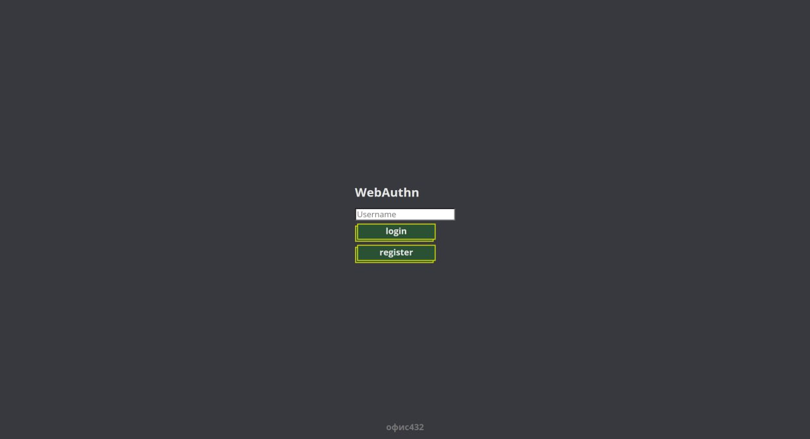
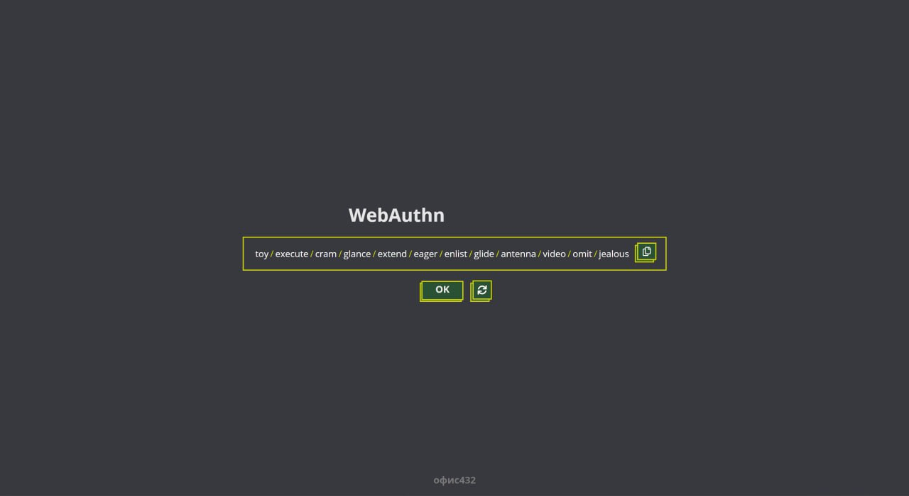

# WebAUF


# Описание





[Презентация](https://docs.google.com/presentation/d/11jLLNxYP66JuzLdZFsEfOmXil3LCTsE58ldrIdV-BcE/edit?usp=sharing)

## Стек-технологий
* Python
* Django
* GraphQL
* PostgreSQL
* Docker + Docker-compose
* Gunicorn
* TypeScript
* React
* Nginx
---


## Git flow

### Основные ветки

**develop:** основная рабочая ветвь. Все новые ветки создаём из неё.  Она содержит код, готовый для тестирования.

**release**: содержит стабильный протестированный код. Код в этой ветке всегда готов к деплою на продакшн.

**Нельзя** делать коммиты напрямую в `develop` и `release,` только в свои фичи-ветки (feature branches).

### Ветки и таски

* На каждую задачу создается отдельная ветка. Вся работа над задачей ведется в этой ветке.

* Формат имени ветки: (фича **feature/name**, фикс **fix/name**) и одно или несколько английских слов, описывающих задачу, через дефисы.

* Смердженные ветки удаляются после PR, **но только когда все изменения приняты, проверены и внесены правки.**

*  Следующую ветку проекта в идеале нужно создавать после того, как приняли и смерджили предыдущие задачи с одной из основных веток для того, чтобы не переделывать в старых ветках те изменения, которые были внесены на проверке PR.

* Каждый PR должен быть рабочей версией проекта, которую можно запустить или залить на сервер.

* Можно параллельно делать несколько задач и сдавать их сразу несколько, но тогда нужно вносить изменения по одному из PR в каждую ветку из активных задач

### Как писать коммиты

**4 вида коммитов**

`[*]` - рефакторинг\изменения логики, исправление багов

`[+]` - добавление фичи

`[-]` - удаление файла\фичи

`[~]` - правки, не влияющие на логику проекта (например, линтеры)

**В каждом коммите следует писать Reason(R:) и fixed by(FB:)**

**R**: причина коммита, что этот коммит изменил

**FB**: как исправили, каким способом решили проблему

**Пример правильного коммита:**

[~] правки форматирования и lint

R: код был не оптимальным и плохо форматированным

FB: использовал eslint и prettier

### Как оформлять PR

1. **Заголовок**

В заголовке следует назвать реализованный функционал (что было добавлено, кратко). В самом начале надо указать `BUGFIX` (в случае, если были исправления багов) или `FEAT` (добавление нового функционала). Если PR ещё не готов к просмотру, следует пометить его как черновик (Draft).

2. **Описание**

В описании есть два основных пункта:

* Что было сделано (краткое описание основного функционала приложения)

* Отчет о тестировании (описание тестирования конкретного функционала)
h
3. **Reviewer**

**Обязательно сделать review-request** на [@lyaguxafrog](https://github.com/lyaguxafrog), если задача связана с Backend'ом или CI/CD, или [@talkingmachine](https://github.com/talkingmachine), если задача связана с Frontend'ом.

### Объем изменений в PR

Изменений в каждом mr должно быть не более 500 строк (добавление и удаление в сумме).


## Разработка:

### Backend

Для разработки проекта установите [vscode](https://code.visualstudio.com/) и [vscode-remote-containers](https://code.visualstudio.com/docs/remote/containers).

### Конфигурация проекта
Для генерации проекта:
```bash
./deploy.sh config
```

### Environment variables
 * `SECRET_KEY` - Секретный ключ джанго, для генерации используйте: https://djecrety.ir/
 * `DEBUG` - Флаг для дебаша
* `DB_NAME` - PostgreSQL db name.
* `DB_USER` - PostgreSQL db user.
* `DB_PASSWORD` - PostgeSQL db password.


### Codding

Для выполнения миграций:

```bash
./manage.sh migrate
```

Чтобы создать django-приложение:
```bash
./manage.sh app
```
Команда создаст приложение со следущей структурой:
```
app/
├── admin
│   └── __init__.py
├── apps.py
├── __init__.py
├── models
│   └── __init__.py
├── schema
│   ├── __init__.py
│   └── schema.py
└── services
    └── __init__.py
```
Дампнуть GQL-Схему:
```bash
./manage.sh gql
```


Создать суперюзера:
```bash
./manage.sh su
```


Зайдите на  http://localhost:8000/admin  для админ панели. Откройте http://localhost:8000/api чтобы перейти на graphql api sandbox.


### Deploy
Для деплоя нужно:

1. Создать конфиг:
```bash
./deplo.sh config
```

2. Собрать фронтенд:
```bash
./deploy.sh build
```

3. Скачать TLS-сертификат:
```bash
./deploy.sh ssl
```

4. Деплой!
```bash
./deploy.sh
```

на локальной машине оно запустится на  http://0.0.0.0/


&copy; Gen by [PBD](https://github.com/lyaguxafrog/python-backend-devcontainers) with 💚
